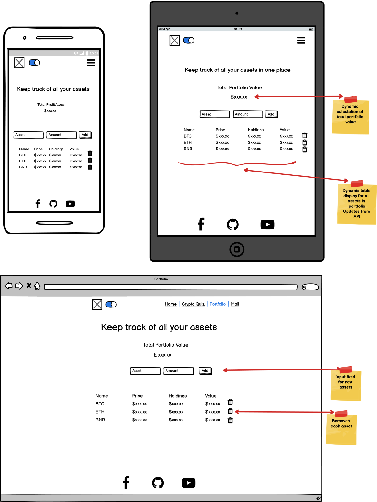

# **Second Milestone Project - Interactive Frontend Development - Code Institute**


- [**User Experience**](#user-experience)
- [**Strategy**](#strategy)
  * [**Project Goals**](#project-goals)
  * [**User Goals**](#user-goals)
  * [**User Stories**](#user-stories)
  * [**Design**](#design)
- [**Scope**](#scope)
  * [Feature requirements](#feature-requirements)
- [**Structure**](#structure)
  * [**Wireframes**](#wireframes)
- [**Features**](#features)
    + [**Landing Page**](#landing-page)
    + [**Quiz**](#quiz)
    + [**Portfolio**](#portfolio)
    + [**Navbar**](#navbar)
    + [**Email Modal**](#email-modal)
    + [**Footer**](#footer)
    + [**404 Page**](#404-page)
* [**Technologies Used**](#technologies-used)
* [**Testing**](#testing)
* [**Testing of User Stories**](#testing-of-user-stories)
* [**Bugs**](#bugs)
* [**Deployment**](#deployment)
* [**Credits**](#credits)
  * [**Acknowledgements**](#acknowledgements)
  * [Disclaimer](#disclaimer)


## **You can find the deployed website** [**HERE**](https://cristianbuca.github.io/MS2_MyCrypto/)

# **User Experience**

The webapp is designed as an interactive project that gives the user the ability to build a crypto-currency portfolio that is stored on their own computer without having to share their data with 3rd parties.

# **Strategy**

##  **Project Goals**
* Use crypto-currency APIs to display relevant data to the user.
* Offer the user the ability to build their portfolio on our platform.
* Offer the user an interactive way of learning more about blockchain and testing their knowledge.
* Offer a way for the user to communicate with the owner.

## **User Goals**
* Find price and performance related information for the main crypto-currencies by market valuation.
* Ability to customize a list of currencies and store the data on my device.
* Ability to view the current valuation of assets and portfolio.
* Learn blockchain related information and test my knowledge.

## **User Stories**

**New Users:** 

1. As a new user, I want to see recent data on major crypto-currencies by market capitalization.
2. As a new user, I want to add personal crypto-currency assets.
3. As a new user, I want to see the asset valuation.
4. As a new user, I want to see the total portfolio valuation.
5. As a new user, I want to learn new information relating to the blockchain.
6. As a new user, I want to learn more about the knowledge quiz.

**Regular Users:**

7. As a regular user, I want to store my portfolio data.
8. As a regular user, I want the option to change the current webapp color theme.
9. As a regular user, I want the ability to edit previous portfolio entries.
10. As a regular user, I want to test the previously acquired knowledge.


**Site Owner:**

11. As a site owner, I want the knowledge quiz to be versatile and easy to update.
12. As a site owner, I want to provide the user a way to get in contact.
13. As a site owner, I want to showcase my social media.

## **Design**

I have opted for minimalist design focused on user interactivity. The user has the ability to switch between Light and Dark modes with the help of the suggestive switch that is always accessible on the Navbar.
The webapp was designed with a mobile-first approach using BootStrap grid for elements to re-arrange based on screen size. 
The Navbar was also built using BootStrap and collapses on small devices remaining fixed on top of the screen for easy access to the color theme switcher and links.

### **Colour Palette**


Midnight Blue | Red Orange | Ebony | Misty Blue
--- | --- | --- | ---
#00478F | #FF5D00 | #2A231F | #D8E1E7

### **Font Scheme**

Font Scheme is comprised of the fonts from the Ubuntu Family for titles, Oxygen Family for information of focus and Fira Sans for general text. These fonts were chosen using Google Fonts as they compliment each other.

# **Scope**

## Feature requirements:

* Responsive webapp for all devices.
* Navigation bar that adapts to device size.
* Landing Page displaying current information on major crypto-currencies using calls to an external API (CoinGeko API).
* Interactive display of secondary information on major crypto-currencies.
* Personalized Portfolio Page displaying user assets data by calling external API(CoinGeko API).
* Portfolio interactivity (ability to add and remove assets by user).
* Portfolio persistance by storing data on the user's machine.
* Interactive quiz with information from the crypto-space.
* Modal with extra information on the quiz design and interaction.
* Modal with built in e-mail function using external API (EmailJS).
* Interactive color theme switch.
* Customized 404 Error Page.
* Favicon icons.

# **Structure**

## **Wireframes**

<details>
  <summary> (Expand) Landing Page Wireframes.</summary>


</details>

<details>
  <summary> (Expand) Quiz Page Wireframes.</summary>


</details>

<details>
  <summary> (Expand) Portfolio Page Wireframes.</summary>


</details>

<details>
  <summary> (Expand) Email Modal Wireframes.</summary>


</details>

# **Features**

### **Landing Page**

The Landing Page features a grid displaying major crypto-currencies and their current prices. Currencies are organized by market capitalization in descending order. Each currency is displayed in it's own badge that the user can interact with by mouse hover (or tap on touch devices), to access 24-hour high and low prices.
All the data displayed is generated dynamically through JavaScript and the [CoinGeko API](https://www.coingecko.com/en/api).

All coin badges are dynamically generated with JavaScript and the moment them being displayed are instant confirmation that the information they are viewing is up to date and the API is up and running.

*User stories solved by this feature:*

* 1 - As a new user, I want to see recent data on major crypto-currencies by market capitalization.

<details>
  <summary> (Expand) Landing Page on different device widths.</summary>


</details>

### **Quiz**

The Quiz Page displays a quiz with crypto-currency related questions. Each question is accompanied by a different picture and the pictures featured are hidden on small devices to maintain focus on the quiz.

The info icon at the top of the quiz triggers the Info Modal when clicked, displaying more information on interacting with the game.

At the bottom of the quiz area, a stopwatch is displayed which is triggered when the user clicks the Start Button and stops when End Screen is displayed. 
On the opposite side, score is kept based on the correct or wrong answers the user selected.

The user is able to choose multiple answers before going to the next question. Feedback to the user is provided in the form of the buttons changing colors and and extra message being displayed when selecting the correct answer which provides additional information related to the question. 

The choices in the design were made for first time users to maintain engagement with the information in the quiz. The implementation of a stopwatch instead of a countdown timer and by giving the user the ability to keep trying until they select the right answer before moving to the next question, provides the first time user with the chance to learn something new on initial interactions with the game.

For the returning user the stopwatch and the score keeping provides the ability to test previously acquired knowledge and a challenge to beat previous score and completion time. 
Score is kept not only by rewarding points for right answer selections but by deducting points for wrong answers. Coupled with the stopwatch feature it adds a variable layer of difficulty and replay value to the game.

The quiz is built to be versatile and easy to update. By loading the questions from a separate file in JSON format the site owner is able to easily change or update game. The quiz is able to adapt to variable number of questions as the HTML is dynamically generated through JavaScript.

*User stories solved by this feature:*

* 5 - As a new user, I want to learn new information relating to the blockchain.
* 6 - As a new user, I want to learn more about the knowledge quiz.
* 10 - As a regular user, I want to test the previously acquired knowledge.
* 11 - As a site owner, I want the knowledge quiz to be versatile and easy to update.

<details>
  <summary> (Expand) Quiz Features.</summary>


</details>

### **Portfolio**

The Portfolio Page displays all the user's assets in the form of a table. The user is able to add different currencies by inputting either the name, symbol or by selecting it from a searchable drop-down list; along with the quantity for each asset. Before the asset is added to the portfolio, user input is checked against the list of all coins received from the API. Once it is validated the asset is displayed with the current market price and with a calculation of how much the user's holdings are valued at. Valuations are made both individually per asset and as a total. Users are able to remove assets from their portfolio by interacting with the rubbish bin adjacent to it.

This page makes heavy use of the [CoinGeko API](https://www.coingecko.com/en/api). When the user inputs a cryptocurrency name, symbol or just manually selects it from the searchable dropdown list, a check is made against the list fetched from the API and if a match is found then the asset ID is stored in LocalStorage as a key and the asset amount input is stored as the value. This allows the user to keep their portfolio data on their own computer.
Due to the large number of cryptocurrencies (over 9000!!!) different endpoints need to be called for the input list and the market list which displays much more detailed information on each cryptocurrency.
The keys and values from LocalStorage are converted to JSON format and based on the IDs a custom link is generated when calling the API market list endpoint and only the coins selected by the user are being fetched.
Information is then dynamically displayed in the form of a table and asset value is calculated on each API call based on the key value provided by the user and stored in LocalStorage.

To update de asset list the user only has to input the same coin with different value.
To remove an asset completely the user can click the rubbish bin at the end of the asset's row.


*User stories solved by this feature:*

* 2 - As a new user, I want to add personal crypto-currency assets.
* 3 - As a new user, I want to see the asset valuation.
* 4 - As a new user, I want to see the total portfolio valuation.
* 7 - As a regular user, I want to store my portfolio data.
* 9 - As a regular user, I want the ability to edit previous portfolio entries.

<details>
  <summary> (Expand) Portfolio showcase.</summary>


</details>

### **Navbar**

The Navbar is responsive to the size of the user's device and houses the Light/Dark Theme Switch. By using the browsers Session Storage the selected theme is kept between pages for the duration of the browsing session. The theme toggler provides an extra layer of user interaction with instant feedback in the form of the background, font and shadow color change.

*User stories solved by this feature:*

* 8 - As a regular user, I want the option to change the current webapp color theme.

<details>
  <summary> (Expand) Navbar </summary>


</details>

### **Email Modal**

The Email Modal makes use of the EmailJS API to give the user the ability to send emails to the site owner directly from the webapp.
Validation of the input fields is done on the front-end side with javascript and will prevent the form to be submitted with empty fields or an invalid email address syntax. Once the fields have been validated and form submitted the user receives confirmation in the form of an alert.

*User stories solved by this feature:*

* 12 - As a site owner, I want to provide the user a way to get in contact.

<details>
  <summary> (Expand) Email Modal </summary>


</details>

### **Footer**

In the footer, the user can find links the owner social medial.

*User stories solved by this feature:*

* 13 - As a site owner, I want to showcase my social media.

<details>
  <summary> (Expand) Footer </summary>


</details>

### **404 Page**

The 404 Error Page is displayed in case of broken or absent links. It provides the user with the ability to go back to one of the webapp pages and maintains user engagement.

<details>
  <summary> (expand) 404 Error Page</summary>


</details>

## **Technologies Used**

* **[HTML5](https://html.spec.whatwg.org)**
* **[CSS3](https://www.w3.org/Style/CSS/Overview.en.html)**
* **[JavaScript](https://www.javascript.com)**
* **[Bootstrap v3.4.1](https://getbootstrap.com)** Components for the navbar, email modal and grid system were taken from the Bootstrap library.
* **[JQuery 3.6.0](https://jquery.com)** Was used for dom manipulation.
* **[Github](https://github.com)** For storing my repository.
* **[Github Desktop](https://desktop.github.com)** For managing synchronizations between local and cloud-stored repositories.
* **[Git](https://git-scm.com)** For version control.
* **[VSCode](https://code.visualstudio.com)** IDE for writing code.
* **[Font Awesome](https://fontawesome.com)** Provided the icons for social media links.
* **[Google Fonts](https://fonts.google.com)** Ubuntu, Oxygen and Fira Sans font families were used as default fonts for the web application.
* **[Optimizilla](https://imagecompressor.com)** To optimize images for web applications.
* **[Favicon.io](https://favicon.io)** For creating the favicon.
* **[Canva.com](https://www.canva.com)** Color scheme generator.
* **[Namecheap.com](https://www.namecheap.com/logo-maker/app/new)** For creating the logo.
* **[EmailJs API](https://www.emailjs.com)** Is used to enable email exchange from the webapp.
* **[CoinGeko API](https://www.coingecko.com/en/api)** Is used to fetch cryptocurrency information.
* **[AmIResponsive](http://ami.responsivedesign.is)** For the multi-device mockup.
* **[Markdown ToC](https://ecotrust-canada.github.io/markdown-toc/)** Used to generate the table of contents for Readme.md

## **Testing**

### HTML validation was carried out with [W3 Validator](https://validator.w3.org).

<details>
  <summary> (expand) Home Page HTML Validation found 0 errors:</summary>


</details>

<details>
  <summary> (expand) Quiz Page HTML Validation found 0 errors, 2 warnings:</summary>


</details>

<details>
  <summary> (expand) Portfolio Page HTML Validation found 0 errors, 2 warnings:</summary>


</details>

<details>
  <summary> (expand) 404 Page HTML Validation found 0 errors:</summary>


</details>

### CSS validation was carried out with [W3 Jigsaw](https://jigsaw.w3.org/css-validator/).

<details>
  <summary> (expand) css.style Jigsaw Validation found 0 errors:</summary>


</details>

### Accessibility Evaluation was carried out with [WAVE Web Accessibility Evaluation Tool](https://wave.webaim.org).

<details>
  <summary> (expand) Home Page WAVE Validation found 0 errors, 2 alerts:</summary>


</details>

<details>
  <summary> (expand) Quiz Page WAVE Validation found 0 errors, 3 alerts:</summary>


</details>

<details>
  <summary> (expand) Portfolio Page WAVE Validation found 0 errors, 3 alerts:</summary>


</details>

<details>
  <summary> (expand) 404 Page WAVE Validation found 0 errors, 2 alerts:</summary>


</details>

### Performance Tests were carried out using Chrome Lighthouse DevTools.

<details>
  <summary> (expand) Home Page Lighthouse Test:</summary>


</details>

<details>
  <summary> (expand) Quiz Page Lighthouse Test:</summary>


</details>

<details>
  <summary> (expand) Portfolio Page Lighthouse Test:</summary>


</details>

<details>
  <summary> (expand) 404 Page Lighthouse Test:</summary>


</details>

### JavaScript Code Tests were carried out with [JShint](https://jshint.com).

JSHint warnings are due to the use of shorthand for IF statements and the use of JQuery where JSHint interprets "$" as an unknown variable.

<details>
  <summary> (expand) email.js JSHint found 0 errors:</summary>


</details>

<details>
  <summary> (expand) home.js JSHint found 0 errors 1 warning:</summary>


</details>

<details>
  <summary> (expand) quiz.js JSHint found 0 errors 1 warning:</summary>


</details>

<details>
  <summary> (expand) quiz_data.js JSHint found 0 errors:</summary>


</details>

<details>
  <summary> (expand) portfolio.js JSHint found 0 errors, 3 warnings:</summary>


</details>


### Devices used for physical testing: 

* Samsung Galaxy S8,
* Samsung Tab A 9.7-inch tablet,
* 17-inch 1080p Laptop (Google Chrome, Mozilla Firefox, Opera, Microsoft Edge browsers),
* 24-inch 1080p Display (Google Chrome, Mozilla Firefox, Opera, Microsoft Edge browsers),
* 32-inch 2040p Display (Google Chrome, Mozilla Firefox, Opera, Microsoft Edge browsers).

Application performs as intended on all devices.

## **Testing of User Stories**

_GitHub does not allow videos hosted in the local repository to be played on the repository page.
Although when viewing on GitHub these videos appear fine, they might not be available in this format if this project is forked. Please refer to the Local Links if needed._


### 1. As a new user, I want to see recent data on major crypto-currencies by market capitalization.

|Feature | Action | Expected Result | Actual Result |
| --- | --- | --- | --- |
| Coin Badges on Landing Page | Load Landing Page. Hover over individual badges. | View current price for each currency. View 24 hour price highs and lows. | Works as expected |

<details>
  <summary> (Expand - User Story 1 testing video) </summary>

  https://user-images.githubusercontent.com/79543676/140587509-0f297a4c-b235-48f1-add7-e797432f4f5a.mp4

  [Local Link](docs/test_user_stories/user_story_1_test.mp4)
</details>

### 2. As a new user, I want to add personal crypto-currency assets.

|Feature | Action | Expected Result | Actual Result |
| --- | --- | --- | --- |
| Portfolio Page | Click the "Portfolio" Link in navbar. Click on Asset Input Field. Input symbol, name or select from list the asset. Click on "Enter amount" Input Field. Enter amount. Click "Add" button. | See the asset added to the table. | Works as expected |

<details>
  <summary> (Expand - User Story 2 testing video) </summary>

  https://user-images.githubusercontent.com/79543676/140587736-5d87a52a-8c8d-4aab-a639-995638890542.mp4

  [Local Link](docs/test_user_stories/user_story_2_test.mp4)
</details>

<details>
  <summary> (Expand - User Story 3 testing video) </summary>

  https://user-images.githubusercontent.com/79543676/140587959-09b0f953-1d3e-4860-af74-68dfcda3cd13.mp4

  [Local Link](docs/test_user_stories/user_story_3_test.mp4)
</details>

<details>
  <summary> (Expand - User Story 4 testing video) </summary>

  https://user-images.githubusercontent.com/79543676/140588272-5daa2760-1f20-4c34-95ac-5e3d054a532b.mp4

  [Local Link](docs/test_user_stories/user_story_4_test.mp4)
</details>

<details>
  <summary> (Expand - User Story 5 testing video) </summary>
 
  https://user-images.githubusercontent.com/79543676/140588329-9636efce-2a13-4e88-9e22-93e0315f6c33.mp4

  [Local Link](docs/test_user_stories/user_story_5_test.mp4)
</details>

<details>
  <summary> (Expand - User Story 6 testing video) </summary>

  https://user-images.githubusercontent.com/79543676/140588369-5b27cec6-1fd5-4d6e-a3d4-1142d739b90c.mp4

  [Local Link](docs/test_user_stories/user_story_6_test.mp4)
</details>

<details>
  <summary> (Expand - User Story 7 testing video) </summary>

  https://user-images.githubusercontent.com/79543676/140588411-7e35764d-4540-418d-bdbb-b4aca894e4d0.mp4

  [Local Link](docs/test_user_stories/user_story_7_test.mp4)
</details>

<details>
  <summary> (Expand - User Story 8 testing video) </summary>

  https://user-images.githubusercontent.com/79543676/140588507-401f9bdd-999f-4bcf-8af4-13aa38fea442.mp4

  [Local Link](docs/test_user_stories/user_story_8_test.mp4)
</details>

<details>
  <summary> (Expand - User Story 9 testing video) </summary>

  https://user-images.githubusercontent.com/79543676/140588553-39bdb347-bf92-49c2-a5ac-56e3c12a9d17.mp4

  [Local Link](docs/test_user_stories/user_story_9_test.mp4)
</details>

<details>
  <summary> (Expand - User Story 10 testing video) </summary>

  https://user-images.githubusercontent.com/79543676/140588603-f212437f-b608-4cd6-b7b4-f3445ee00d1e.mp4

  [Local Link](docs/test_user_stories/user_story_10_test.mp4)
</details>

<details>
  <summary> (Expand - User Story 11 testing video) </summary>

  https://user-images.githubusercontent.com/79543676/140588644-1648d384-a124-4d29-a357-085bc7a9844f.mp4

  [Local Link](docs/test_user_stories/user_story_11_test.mp4)
</details>

<details>
  <summary> (Expand - User Story 12 testing video) </summary>

  https://user-images.githubusercontent.com/79543676/140588680-4250c1ec-af3e-48f5-8bfa-d4512ff0b61d.mp4

  [Local Link](docs/test_user_stories/user_story_12_test.mp4)
</details>

<details>
  <summary> (Expand - User Story 13 testing video) </summary>

  https://user-images.githubusercontent.com/79543676/140588734-cf40597a-d084-48f9-8e8f-e13823850f84.mp4

  [Local Link](docs/test_user_stories/user_story_13_test.mp4)
</details>


## **Bugs**

* Bug: Event listener does not trigger on the dynamically generated answer buttons.
* Fix: Apply the event listener to the button container and add selector for the clicks only on the buttons in the container.
Credit to [StackOverflow](https://stackoverflow.com/questions/1359018/how-do-i-attach-events-to-dynamic-html-elements-with-jquery)

* Bug: Multiple clicks on the same answer result function checkAnswer() being triggered multiple times resulting in erroneous score count and multiple displays of validation message for correct answers.

<details>
  <summary> (Expand) Multiple clicks being registered on the same answer:</summary>

  https://user-images.githubusercontent.com/79543676/140570994-a560320e-ff33-48ef-8a08-b01cb1c00213.mp4
</details>

* Fix: Each answer button is added an extra class when being generated and event listener for clicks on answers is targeting the class instead of the button element. When checkAnswer() function is triggered for the first time for each answer removes the class from the button preventing the event listener from registering extra clicks.

* Bug: Unable to add assets to the portfolio that contain a space in their name.
* Fix: Store assets in localStorage by ID instead of NAME and call API based on IDs instead of their names.

* Bug: Method to generate random number to select an image from assets to display with each quiz question includes "0" while images names start from 1. Whenever 0 would be generated no image would be displayed and console would display the error:

```GET http://127.0.0.1:5501/assets/img/quiz_img/quiz_0_min.jpg 404 (Not Found)```

* Fix: Add 1 to all random numbers generated.

## **Deployment**

The website is hosted and deployed from Github. The steps taken for deployment were:

1. Logged into my [Github](https://github.com) account,
2. Selected the [Repository](https://github.com/CristianBuca/The-Aunans),
3. Go to [Settings](https://github.com/CristianBuca/The-Aunans/settings),tab on the horizontal menu,
4. Go to [Pages](https://github.com/CristianBuca/The-Aunans/settings/pages) tab on the vertical sub-menu,
5. Selected the **Main Branch** from the drop-down menu under **Source**,
6. Selected the **/(root)** folder where my **index.html** was located,
7. Clicked **Save**,
8. Once the page was refreshed I was presented with the link to the live website as seen in the image below:


**Steps to follow for cloning this repository:**

1. Log into your [Github](https://github.com) account,
2. Select the [Repository](https://github.com/CristianBuca/The-Aunans),
3. Click on the drop-down menu title **Code** on the top right of the repository file tree,
4. Copy the HTTPS address,
5. In your Git Bash Terminal type *"git clone"* then paste the address.

*Alternatively you can download the repository as ZIP or use [Github Desktop](https://desktop.github.com) to ge the repository on you local machine*

**Using the EmailJS API:**

1. Create an account/login on [EmailJS Website](https://www.emailjs.com).
2. Go to Email Services and add an e-mail service of your choice.
3. Got to Email Templates and create one.
4. On the integration tab find User ID and Access Token.
5. Update script with ID and token.
6. Extra documentation on the API can be found [Here](https://www.emailjs.com/docs/).

**Using the CoinGeko API:**

1. CoinGeko offers a free plan for the API that does not require signing up for it.
2. Going on the [documentation page](https://www.coingecko.com/en/api/documentation) provides information for each endpoint.
3. Expand endpoint of interest and click "Try it out", fill in parameters that match your query and click "Execute".
4. Use the generated URL to make the call to the API.
5. Along with the URL a response body preview and headers are also available to view in the description.

<details>
  <summary> (Expand) CoinGeko API Test </summary>


</details>

<details>
  <summary> (Expand) CoinGeko API response </summary>


</details>

## **Credits**

_I have followed dozens of projects and video tutorials trying to find the solutions that would fit this project.
Some influenced my approach on how to build this site and others were specific to a particular issue I encountered.
Any code that was borrowed has been modified and adapted to fit my particular needs._

**JavaScript/Jquery code:**

* Expression to validate if the input is in the form of an e-mail address from [StackOverflow](https://stackoverflow.com/a/9204568).
* To be able to find a building approach for the quiz I watched videos from [Brian Design](https://www.youtube.com/watch?v=f4fB9Xg2JEY&list=PL2jRjGd6MDrTTDyM7MJNX50Pyf9AYeEma&index=7&t=2726s), [Florin Pop](https://www.youtube.com/watch?v=dtKciwk_si4&list=PL2jRjGd6MDrTTDyM7MJNX50Pyf9AYeEma&index=16&t=1870s), [Web Dev Simplified](https://www.youtube.com/watch?v=riDzcEQbX6k&list=PL2jRjGd6MDrTTDyM7MJNX50Pyf9AYeEma&index=8&t=1442s). The latter has been the most influential as it was the closest to what I was aiming for.
* The stopwatch feature in the quiz was built based on [Crypters Infotech](https://www.youtube.com/watch?v=EGD_A118efI&list=PL2jRjGd6MDrRDnC2R302N2rE0sRUinGyl&index=14&t=227s) 6-part tutorial.
* For using localStorage/sessionStorage which I used for the portfolio and the theme switch I followed [dcode](https://www.youtube.com/watch?v=k8yJCeuP6I8), [LogRocket](https://blog.logrocket.com/localstorage-javascript-complete-guide/#getitem).
* Approach in iterating localStorage from [StackOverFlow](https://stackoverflow.com/a/37507935).
* The approach in building the cryptocurrency portfolio from [Creepto](https://www.publish0x.com/creepto-on-crypto/diy-code-a-crypto-portfolio-manager-xpjjwll) and there are definite traces of his code in repo.
* Closest() method to target the entire row for removal in the portfolio I found on [Codepedia](https://codepedia.info/jquery-get-table-cell-td-value-div/).
* Syntax for generating dynamic elements with custom CSS from [StackOverFlow](https://stackoverflow.com/a/48754590).
* Method for randomizing questions from [Web Dev Simplified](https://www.youtube.com/watch?v=riDzcEQbX6k&list=PL2jRjGd6MDrTTDyM7MJNX50Pyf9AYeEma&index=8&t=1443s).

**HTML/CSS**

* Using CSS Variables [Fireship](https://www.youtube.com/watch?v=NtRmIp4eMjs).
* CSS style for the Theme Switch checkbox was taken from [Online Tutorials](https://www.youtube.com/watch?v=z3TgmTi42ic).
* For the Quiz Info Modal I watched [Florin Pop](https://www.youtube.com/watch?v=XH5OW46yO8I).
* CSS for the custom buttons was inspired from [CSS Scan](https://getcssscan.com/css-buttons-examples).
* The pop-up in the e-mail form for invalid entries was taken from [W3 Schools](https://www.w3schools.com/howto/howto_js_popup.asp) in combination with [PreTagTeam](https://pretagteam.com/question/jquery-position-popup-in-relative-to-buttons) for positioning it on each input.

**Media**

* Quiz questions/ answers and layout from [CoinTelegraph](https://cointelegraph.com/quiz/think-you-know-the-crypto-basics-take-our-quiz-to-find-out).
* Quiz images from [Pexels](https://www.pexels.com/search/cryptocurrency/).
* 404 Page background image from [Stockvault](https://www.stockvault.net).

### **Code Institute colleagues who's work I followed for guidance:**

[Paul Meeneghan](https://github.com/pmeeny/CI-MS2-BicepMusicFanSite).

[Tara Rhoseyn](https://github.com/TaraRhoseyn/CI_MS2_CardMemoryGame).

## **Acknowledgements**

* Special thanks to my mentor Mo Shami for his suggestions and guidance.
* My family for their encouragement and support.
* Special thanks to Neil from Student Care for helping me through a tough time and everyone else in the Student Care Team that touched bases making sure I am on track.
* The Code Institute team for all the effort and energy they put into creating and curating the content for this programme.

## Disclaimer

_This project is for educational use only and was created as a Milestone Project for the Code Institute Module of Interactive Frontend Development_

Developed by Cristian Buca

